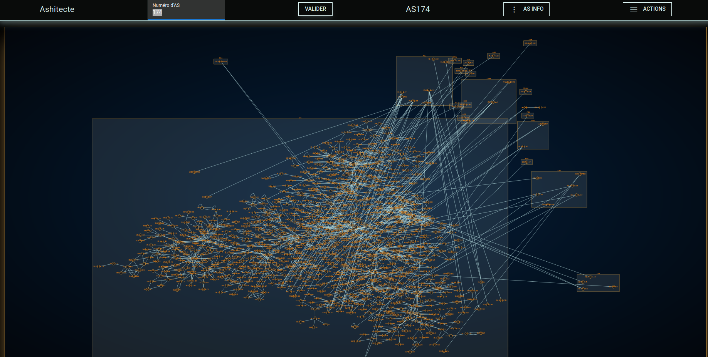

AShitecte est un outil dont l'objectif est de permettre le mappage d'un maximum d'éléments relatifs à l'infrastructure d'un AS spécifique.  

AShitecte donne la possibilité de visualiser ces informations sur une vue par graph de manière à voir principalement les IP, routes et AS.

# Exemple



# Mise en place

## Installation 

```bash
apt install git python3 python3-pip
git clone https://github.com/darcosion/AShitecte
cd AShitecte
pip3 install -r requirements.txt
# mise à jour de la base de données CIDR <-> AS
python3 asinfo/collectas.py
```

## lancement

En premier lieu, ouvrir un bash depuis le repository cloné en local.

```bash
# Si nécessaire, mise à jour de la base de donnée ASinfo
python3 asinfo/collectas.py
# si nécessaire, mise à jour du repo
git pull
# lancement de l'application
sudo python3 webshitecte.py
```

Une fois cela fait, le shell devrait donner une adresse web sur laquelle aller, qui est l'interface web d'AShitecte.

# utilisation

En premier lieu, entrer un numéro d'AS dans le champ concerné :  

  
Cliquer sur "Valider" :  

  
Une fois cela fait, deux menu apparaissement.

Le premier, "asinfo" :  
  
permet de visualiser les informations brutes obtenu sur l'AS qui vont permettre son mappage.

Lorsque l'on clic dessus, il donne en dur les informations d'AS obtenue précédemment : 


Le second, "Actions" :  
  
Permet de lancer les scan qui vont faire apparaître sur le graphe les informations de l'AS.
  


# Objectif

AShitecte vise à devenir un outil de visualisation de l'ensemble des éléments d'infrastructure d'un AS ciblé.

Pour cela, l'objectif et d'obtenir un maximum d'information par tous les moyens possibles et à les retranscrire principalement sur le graph central.

Les méthodes usuels pour obtenir des informations sur un AS consistent à utiliser traceroute pour observer comment il gère son trafic, néanmoins, AShitecte vise à implémenter de nombreuses autres fonctionnalités : 

 - identification de MPLS ?
 - identification de looking-glasses
 - exploitation de données looking-glasses
 - Exploitation de donnée reverse PTR
 - Exploitation de donnée DNS
 - Variation de traceroute
 
